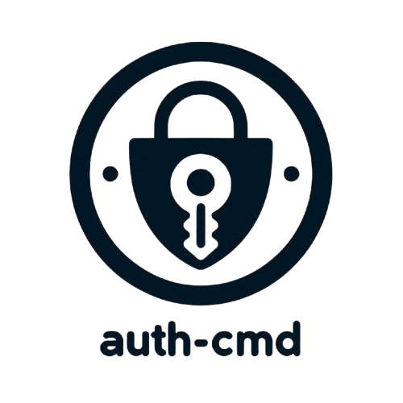

<p align="center">
  
  <!-- <h1 align="center">Auth CMD</h1> -->
  <p align="center">A secure, private command-line tool for TOTP (Time-based One-Time Password) authentication</p>
</p>


> [!CAUTION]
> To ensure the safety of your authentication data, please use auth-cmd only on a secure, private computer.
## Installation

### Install zbar

- **Ubuntu**

```sh
  sudo apt update && sudo apt install -y libzbar-dev
```

- **MacOS**

```sh
  brew install zbar
```

> [!NOTE]  
> If `auth-cmd` cannot locate the `zbar` library after installation, try creating a symbolic link for the zbar shared library:
> [reference](https://stackoverflow.com/questions/63217735/import-pyzbar-pyzbar-unable-to-find-zbar-shared-library/71904987#71904987)

```sh
  mkdir ~/lib
  ln -s $(brew --prefix zbar)/lib/libzbar.dylib ~/lib/libzbar.dylib
```

- **Windows**
  - Download the installer from the [Zbar homepage](https://zbar.sourceforge.net/download.html) and follow the instructions provided.

### Install Package

```sh
pip install auth-cmd
```

## Usage

This tool provides several commands to manage TOTP tokens.

### Add a Token

To add a new token by qr-code

```sh
auth add-qr
```

If you know the secret of a TOTP. You can add a new token by

```sh
auth add
```

### Generate a TOTP

To generate a TOTP for a specific token:

```sh
auth gen <name>
```

The generated TOTP will be copied to your clipboard.

Be Faster: create a alias to speed up the process

```sh
alias ag='auth gen'
```

### List Tokens

To list all existing tokens:

```sh
auth list
```

### Remove a Token

To remove a specific token:

```sh
auth remove <name>
```

### License

This project is licensed under the MIT License. See the LICENSE file for details.

### Author

Ken Lin
